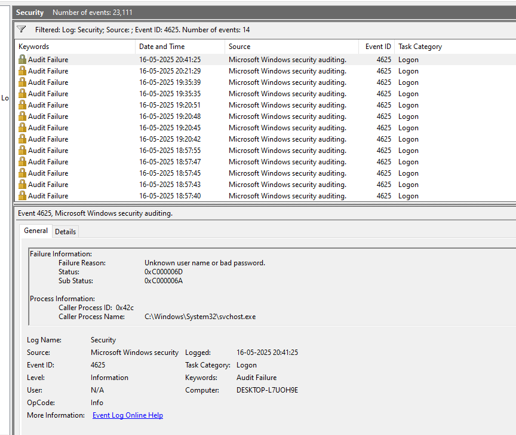

I understand you want to create a report for **Hint 1: Brute Force Login Attempts** in the same format as your previous hints, as a single Markdown file (`hint01_brute_force.md`). The report will follow the structure: **Simulation**, **Command Used**, **Logs Generated**, **Screenshots**, **Analysis**, and **MITRE ATT&CK Mapping**. I’ll provide the raw Markdown content first, followed by the steps to upload it to your GitHub repository.

---

### Markdown Content for `hint01_brute_force.md`

```
# Hint 1: Brute Force Login Attempts

## Simulation
I simulated a brute force attack on my Windows 10 VM by using a PowerShell script to attempt 11 failed logins followed by a successful login, mimicking an attacker trying to guess credentials.

## Command Used
```powershell
for ($i=1; $i -le 11; $i++) {
    net use \\127.0.0.1\IPC$ /user:FakeUser WrongPassword
}
net use \\127.0.0.1\IPC$ /user:FakeUser P@ssword123
```

## Logs Generated
- **Windows Event Viewer:** Captured 11 failed login attempts with Event ID 4625 (Failed Logon) and 1 successful login with Event ID 4624 (Successful Logon).  
- **Wazuh Dashboard:** Displayed the same events, confirming the activity was logged and forwarded.

## Screenshots
- **Event Viewer Logs:** 
- **Event Viewer Logs:** 
- **Event Viewer Logs:** 
- **Event Viewer Logs:** 
- **Wazuh Logs:** 

## Analysis
- **Pattern Observed:** 11 failed login attempts (Event ID 4625) for the user `FakeUser` within a short time frame, followed by a successful login (Event ID 4624).  
- **Fields Analyzed:**  
  - `win.eventdata.targetUserName`: `FakeUser`  
  - `win.eventdata.failureReason`: "Unknown user name or bad password"  
  - `win.eventdata.logonType`: `3` (Network logon)  
  - **Count:** 11 failed logins in quick succession  
- **MITRE ATT&CK Mapping:**  
  - **T1110: Brute Force** (Credential Access): Repeated failed login attempts to guess credentials.  
  - **T1078: Valid Accounts** (Persistence/Privilege Escalation): Successful login using valid credentials.
```

---

