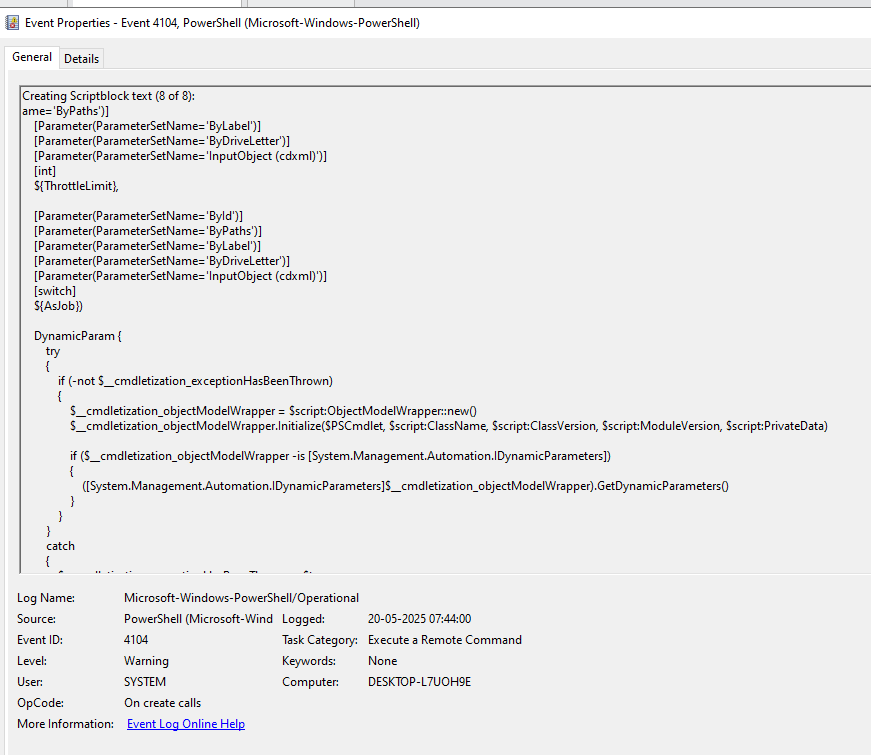

# Hint 2: Suspicious PowerShell Usage

## Simulation
I simulated a suspicious PowerShell command on my Windows 10 VM by running an encoded command that attempts to launch a non-existent executable (`smoch.exe`).

### Command Used
powershell -enc UwB0AGEAcgB0AC0AUAByAG8AYwBlAHMAcwAgACIAcwBtAG8AYwBoAC4AZQB4AGUAIgA=

- **Decoded Command:** `Start-Process "smoch.exe"`

## Logs Generated
- **PowerShell Logs (Event Viewer):** Captured the decoded command `Start-Process "smoch.exe"` (Event ID 4104).
- **Sysmon Logs (Event Viewer):** Captured the process creation for `powershell.exe` with the encoded command line (Event ID 1).
- **Wazuh Dashboard:** Displayed both PowerShell and Sysmon events, confirming the activity was logged and forwarded.

## Screenshots
- PowerShell Logs: 
- Sysmon Logs: 
- Wazuh Logs: 

## Analysis
- **Pattern Observed:** An encoded PowerShell command (`-enc`) was executed, attempting to launch `smoch.exe` (Event ID 4104 and Sysmon Event ID 1).
- **Fields Analyzed:**
  - `win.eventdata.scriptBlockText`: `Start-Process "smoch.exe"`
  - `win.system.commandLine`: Contains `-enc UwB0AGEAcgB0AC0AUAByAG8AYwBlAHMAcwAgACIAcwBtAG8AYwBoAC4AZQB4AGUAIgA=`
  - `win.system.image`: `C:\Windows\System32\WindowsPowerShell\v1.0\powershell.exe`
- **MITRE ATT&CK Mapping:**
  - T1059.001: Command and Scripting Interpreter - PowerShell (Execution)
  - T1027: Obfuscated Files or Information (Defense Evasion)
  
