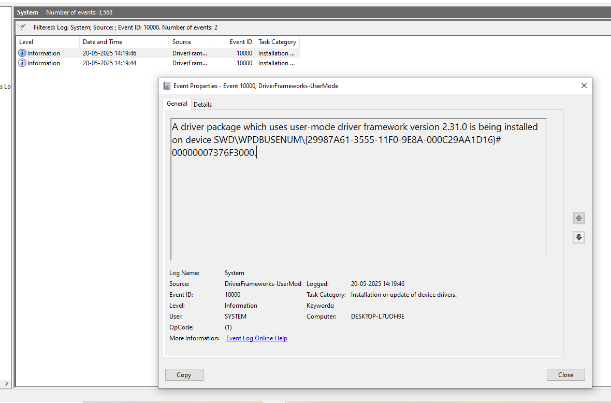
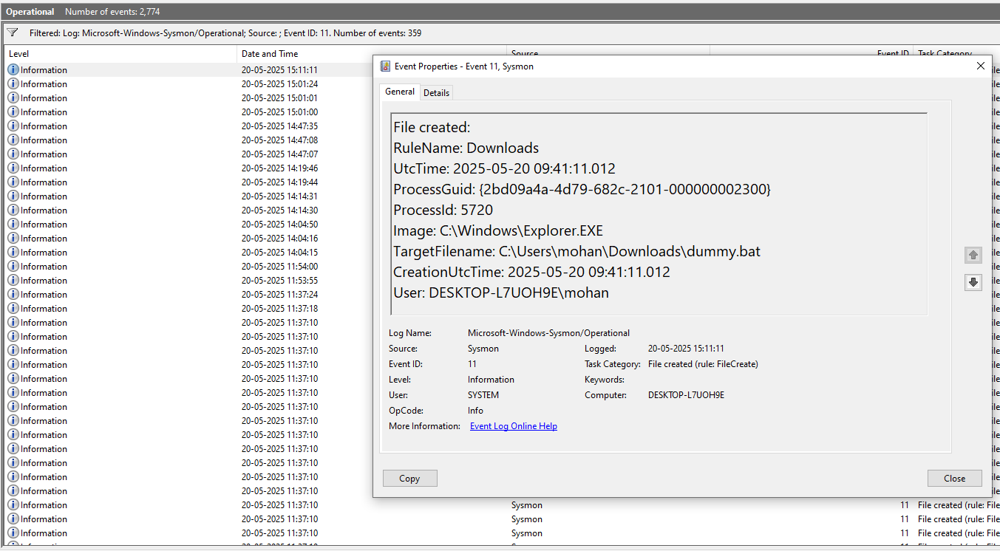
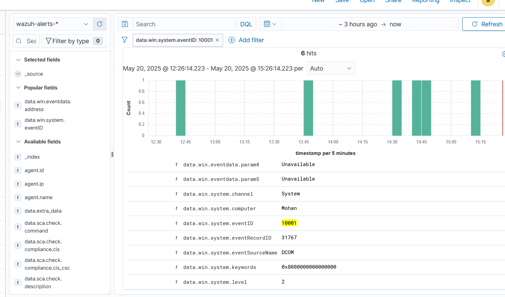

---

# Hint 3: USB Drive Insertion
'''
## Simulation
I simulated a USB drive insertion on my Windows 10 VM by attaching a virtual USB device, copying a dummy batch file (`dummy.bat`) from the USB, and executing it to mimic a malicious action from removable media.

## Command Used
```bat
@echo off
echo This is a simulated malicious file from USB
ping 8.8.8.8 -n 3
```

## Logs Generated
- **Windows System Logs (Event Viewer):** Captured the USB device connection (Event ID 20001/10000).  
- **Sysmon Logs (Event Viewer):** Captured the file creation for `dummy.bat` (Event ID 11), process creation for `dummy.bat` execution (Event ID 1), and network connection for the `ping` (Event ID 3).  
- **Wazuh Dashboard:** Displayed the System and Sysmon events, confirming the activity was logged and forwarded.

## Screenshots
- **System Logs:**   
- **Sysmon Logs:**   
- **Wazuh Logs:** 

## Analysis
- **Pattern Observed:** A USB device was inserted, followed by the copying of `dummy.bat` (Event ID 11), its execution (Event ID 1), and a network connection to `8.8.8.8` (Event ID 3).  
- **Fields Analyzed:**  
  - `data.win.eventdata.targetFilename`: `C:\Users\testuser\Downloads\dummy.bat`  
  - `data.win.system.commandLine`: Contains `dummy.bat`  
  - `data.win.eventdata.destinationIp`: `8.8.8.8`  
- **MITRE ATT&CK Mapping:**  
  - **T1091: Replication Through Removable Media** (Initial Access): USB used to deliver a file.  
  - **T1059: Command and Scripting Interpreter** (Execution): Batch file execution via `cmd.exe`.  
  - **T1071: Application Layer Protocol** (Command and Control): Network activity simulating C2 communication.
```

---

