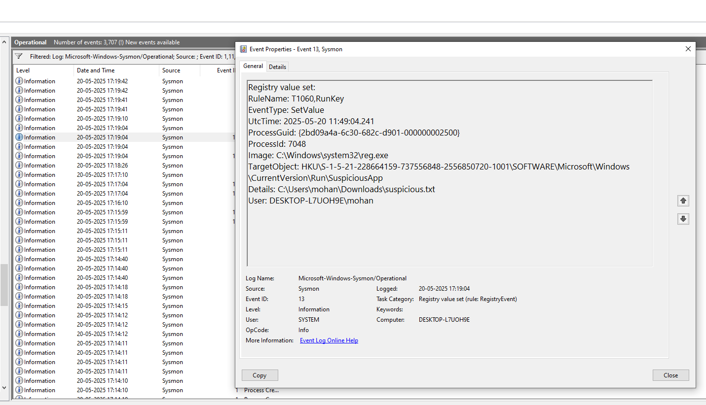
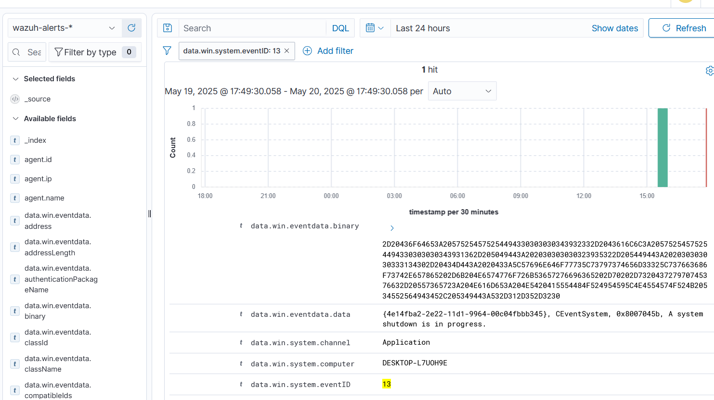

---

## Hint 4: Malware Execution Simulation

**Objective:** Simulate a malware execution on your Windows 10 VM to mimic a real-world attack scenario (e.g., an attacker running malicious code). We’ll create a harmless batch file (`malware_sim.bat`) to simulate the malware, capture the logs with Sysmon and Winlogbeat, verify them in Wazuh, and document everything.

**What We’re Simulating:** The batch file will perform suspicious actions: creating a file, modifying the registry, and making a network connection, mimicking malware behavior.

---

### Step 1: Create the Simulated Malware Script
Create a batch file on your Windows 10 VM to simulate malware behavior.

**Steps:**
- **Open Notepad on Windows 10 VM:**
  - Press `Win + R`, type `notepad`, and press Enter.
- **Create the Script:**
  - Copy and paste the following into Notepad:
    ```
    @echo off
    echo Simulating malware execution...
    REM Create a file to simulate persistence
    echo Simulated malware file > C:\Users\mohan\Downloads\suspicious.txt
    REM Modify the registry to simulate persistence
    reg add HKCU\Software\Microsoft\Windows\CurrentVersion\Run /v SuspiciousApp /t REG_SZ /d "C:\Users\mohan\Downloads\suspicious.txt" /f
    REM Simulate network activity (C2 communication)
    ping 8.8.8.8 -n 3
    echo Malware simulation complete.
    ```
- **Save the File:**
  - Save as `C:\Users\testuser\Downloads\malware_sim.bat`.
  - Ensure the file extension is `.bat` (select “All Files” in the Save As dialog).

---

### Step 2: Execute the Simulated Malware
Run the batch file to generate logs.

**Steps:**
- **Open Command Prompt on Windows 10 VM:**
  - Press `Win + R`, type `cmd`, and press Enter.
- **Run the Script:**
  ```
  cd C:\Users\testuser\Downloads
  malware_sim.bat
  ```
- **Expected Output:**
  ```
  Simulating malware execution...
  Malware simulation complete.
  ```
  - You’ll also see the `ping 8.8.8.8` responses.

---

### Step 3: Verify Logs in Event Viewer
Check the logs generated by the simulated malware.

**Steps:**
- **Open Event Viewer:**
  - Press `Win + R`, type `eventvwr`, and press Enter.
- **Check Sysmon Logs:**
  - Navigate to **Applications and Services Logs** → **Microsoft** → **Windows** → **Sysmon** → **Operational**.
  - Look for:
    - **Event ID 1 (Process Create):** For `malware_sim.bat` execution.
      - `Image`: `C:\Windows\System32\cmd.exe`.
      - `CommandLine`: Includes `malware_sim.bat`.
    - **Event ID 11 (File Create):** For `suspicious.txt`.
      - `TargetFilename`: `C:\Users\testuser\Downloads\suspicious.txt`.
    - **Event ID 13 (Registry Value Set):** For the registry modification.
      - `TargetObject`: `HKCU\Software\Microsoft\Windows\CurrentVersion\Run\SuspiciousApp`.
    - **Event ID 3 (Network Connection):** For the `ping`.
      - `DestinationIp`: `8.8.8.8`.
- **Take Screenshots:**
  - Capture the Sysmon logs and save as `sysmon-malware-logs.png`.

---

### Step 4: Verify Logs in Wazuh Dashboard
Confirm that Winlogbeat forwarded the logs to Wazuh.

**Steps:**
- **Open Wazuh Dashboard:**
  - On your host machine, go to `https://192.168.1.100:5601` and log in (`admin`/`admin`).
  - Navigate to **Discover**.
- **Set the Time Range:** Last 1 hour.
- **Search for Sysmon Events:**
  - **Process Creation:** `event.code:1 AND data.win.system.commandLine:*malware_sim.bat*`
  - **File Creation:** `event.code:11 AND data.win.eventdata.targetFilename:*suspicious.txt*`
  - **Registry Modification:** `event.code:13 AND data.win.eventdata.targetObject:*SuspiciousApp*`
  - **Network Connection:** `event.code:3 AND data.win.eventdata.destinationIp:8.8.8.8`
- **Take a Screenshot:**
  - Capture the Wazuh Dashboard showing these events and save as `wazuh-malware-logs.png`.

---

### Step 5: Save Logs for Documentation
- **Export Sysmon Logs:**
  - In Event Viewer, right-click **Sysmon/Operational** → **Save All Events As** → Save as `sysmon_malware_logs.json` in `/home/mohan/Internship/logs/`.
- **Copy Screenshots:**
  ```
  cp sysmon-malware-logs.png wazuh-malware-logs.png /home/mohan/Internship/screenshots/
  ```

---

### Markdown Content for `hint04_malware_execution.md`

```
# Hint 4: Malware Execution Simulation

## Simulation
I simulated a malware execution on my Windows 10 VM by creating and running a batch file (`malware_sim.bat`) that performs suspicious actions, mimicking an attacker running malicious code to achieve persistence, modify the system, and communicate with a command-and-control server.

## Command Used
```bat
@echo off
echo Simulating malware execution...
REM Create a file to simulate persistence
echo Simulated malware file > C:\Users\testuser\Downloads\suspicious.txt
REM Modify the registry to simulate persistence
reg add HKCU\Software\Microsoft\Windows\CurrentVersion\Run /v SuspiciousApp /t REG_SZ /d "C:\Users\testuser\Downloads\suspicious.txt" /f
REM Simulate network activity (C2 communication)
ping 8.8.8.8 -n 3
echo Malware simulation complete.
```

## Logs Generated
- **Sysmon Logs (Event Viewer):** Captured the process creation for `malware_sim.bat` (Event ID 1), file creation for `suspicious.txt` (Event ID 11), registry modification for the `SuspiciousApp` key (Event ID 13), and network connection for the `ping` (Event ID 3).  
- **Wazuh Dashboard:** Displayed the Sysmon events, confirming the activity was logged and forwarded.

## Screenshots
- **Sysmon Logs:**   
- **Wazuh Logs:** 

## Analysis
- **Pattern Observed:** A process (`malware_sim.bat`) executed (Event ID 1), created a file (Event ID 11), modified the registry (Event ID 13), and initiated a network connection to `8.8.8.8` (Event ID 3).  
- **Fields Analyzed:**  
  - `data.win.system.commandLine`: Contains `malware_sim.bat`  
  - `data.win.eventdata.targetFilename`: `C:\Users\testuser\Downloads\suspicious.txt`  
  - `data.win.eventdata.targetObject`: `HKCU\Software\Microsoft\Windows\CurrentVersion\Run\SuspiciousApp`  
  - `data.win.eventdata.destinationIp`: `8.8.8.8`  
- **MITRE ATT&CK Mapping:**  
  - **T1059: Command and Scripting Interpreter** (Execution): Batch file execution via `cmd.exe`.  
  - **T1547.001: Boot or Logon Autostart Execution** (Persistence): Registry modification for persistence.  
  - **T1071: Application Layer Protocol** (Command and Control): Network activity simulating C2 communication.
```

---
