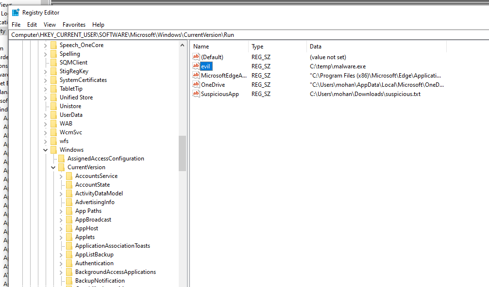
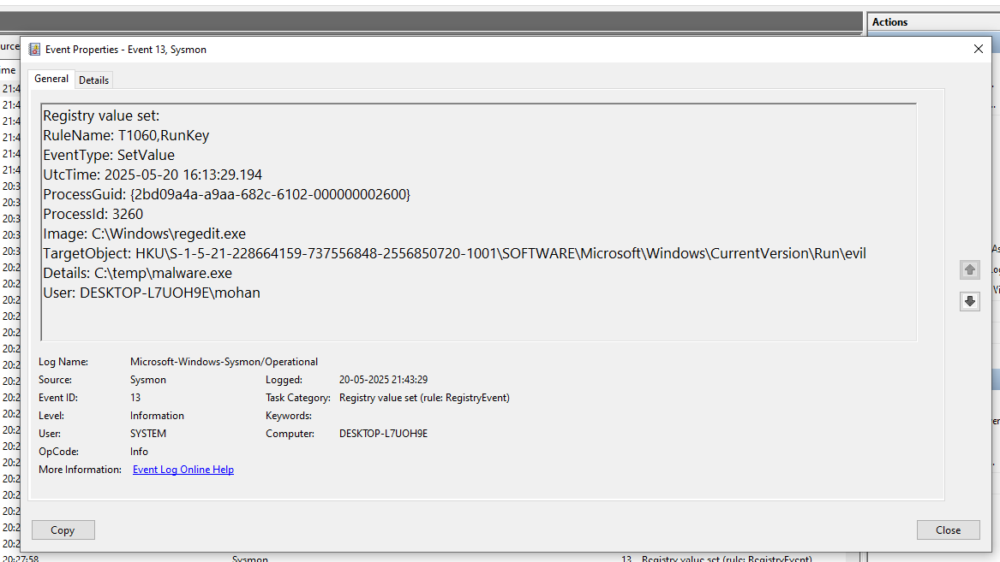

---

# **Registry Modification Simulation: Project Report**

## **Overview**
This project demonstrates how **Windows Registry modifications** can be used for **persistence techniques**, commonly exploited by malware. The goal is to modify a registry key and log its activity using **Windows Event Viewer** and **Wazuh**.

## **Objective**
- Modify the **Startup Registry Key** using **PowerShell**.
- Trigger **Windows Event ID 4657** (Registry Modification).
- Monitor logs in **Event Viewer & Wazuh**.

---

## **Step 1: Executing the Registry Modification**
### **PowerShell Command**
```powershell
Set-ItemProperty -Path "HKCU:\Software\Microsoft\Windows\CurrentVersion\Run" -Name "evil" -Value "C:\temp\malware.exe"
```
### **Explanation**
- **Modifies the `Run` registry key**, making an executable (`malware.exe`) run automatically at login.
- **"evil"** → Name of the registry entry.
- **"C:\temp\malware.exe"** → Assigned executable path.

### **Verification in Registry Editor**
1. Open **Registry Editor** (`Win + R`, type `regedit`, press `Enter`).
2. Navigate to:
   ```
   HKEY_CURRENT_USER\Software\Microsoft\Windows\CurrentVersion\Run
   ```
3. Check for the `"evil"` entry.
4. Screenshot:  
   

---

## **Step 2: Log Analysis**
### **Windows Event IDs to Check**
| **Event ID** | **Description** |
|-------------|----------------|
| **4657**    | Registry modification (logs changes) |
| **4660**    | Registry key deletion |
| **4663**    | Object access (logs interactions with registry keys) |

### **Checking Logs in Wazuh**
1. Open **Wazuh Dashboard**.
2. Navigate to **Security Events**.
3. Filter logs by **Event ID 4657**.
4. Look for modifications under `HKCU:\Software\Microsoft\Windows\CurrentVersion\Run`.
5. Screenshot:  
   

### **Checking Logs in Event Viewer**
1. Open **Event Viewer** (`Win + R`, type `eventvwr`, press `Enter`).
2. Navigate to **Windows Logs > Security**.
3. Search for **Event ID 4657**.
4. Screenshot:  
   

---

## **Step 3: Removing the Registry Entry**
If needed, remove the registry modification using:
```powershell
Remove-ItemProperty -Path "HKCU:\Software\Microsoft\Windows\CurrentVersion\Run" -Name "evil"
```

---

This simulation highlights how **malware achieves persistence** using registry modifications. Observing event logs provides insights into **security monitoring with Wazuh**.

---

