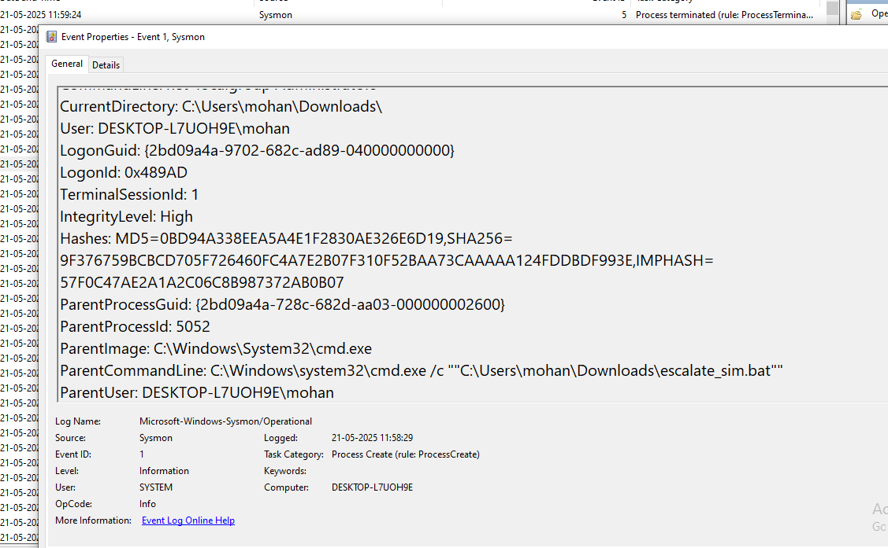
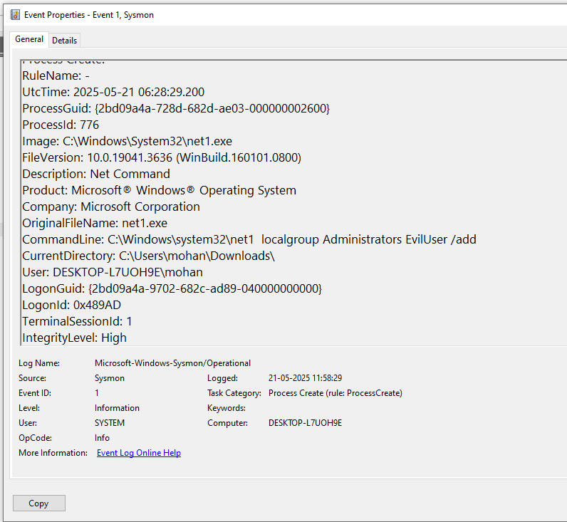
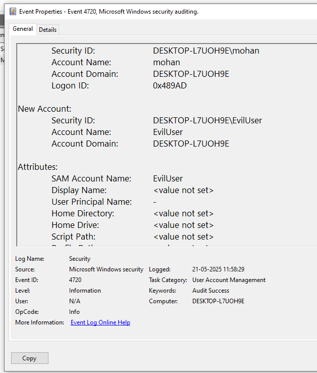
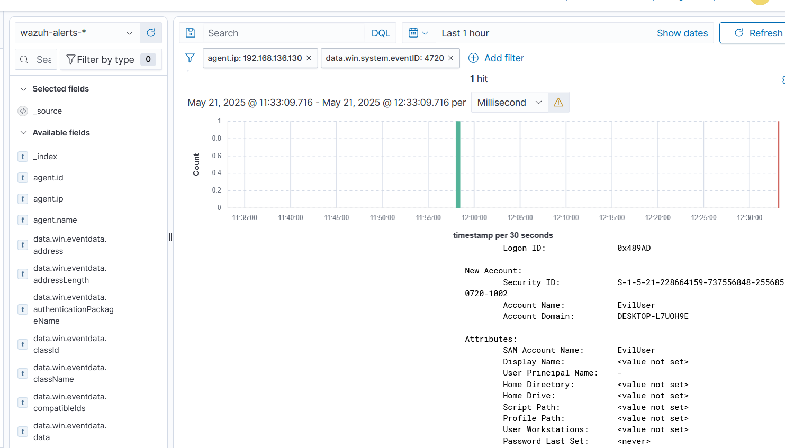
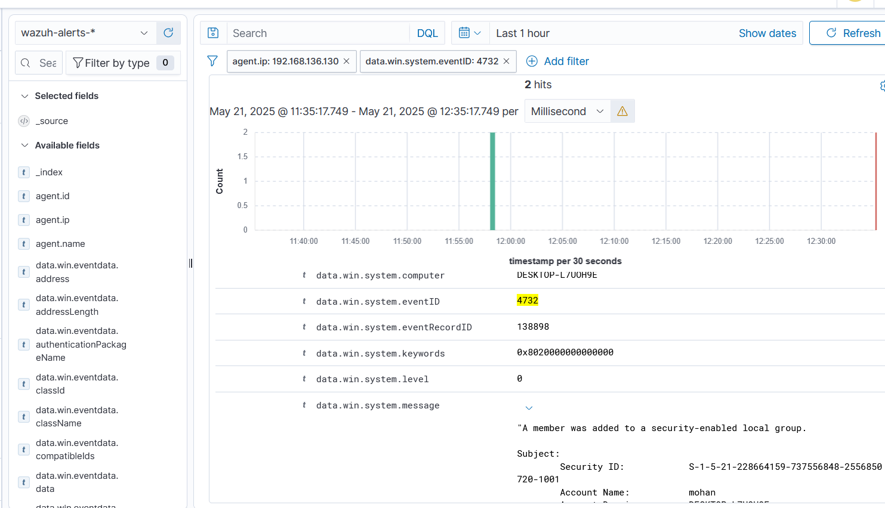

# Hint 6: Privilege Escalation Simulation

## Simulation
I simulated a privilege escalation attack on my Windows 10 VM by creating and running a batch file (`escalate_sim.bat`) that creates a new user and adds them to the administrators group, mimicking an attacker gaining higher privileges.

## Command Used
```bat
@echo off
echo Simulating privilege escalation...
REM Create a new user
net user EvilUser P@ssw0rd123 /add
REM Add the new user to the administrators group
net localgroup Administrators EvilUser /add
REM Simulate a command that requires admin privileges
net localgroup Administrators
echo Privilege escalation simulation complete.
```

## Logs Generated
- **Sysmon Logs (Event Viewer):** Captured the process creation for `escalate_sim.bat` (Event ID 1) and `net.exe` commands (Event ID 1).  
- **Security Logs (Event Viewer):** Captured the user creation (Event ID 4720) and group membership change (Event ID 4732).  
- **Wazuh Dashboard:** Displayed the Sysmon and Security events, confirming the activity was logged and forwarded.

## Screenshots
- **Sysmon Log for `escalate_sim.bat` (Event ID 1):**   
- **Sysmon Log for `net.exe` Commands (Event ID 1):**   
- **Security Log for EvilUser Creation (Event ID 4720):**   
- **Wazuh Log for EvilUser Creation (Event ID 4720):**   
- **Wazuh Log for Group Membership Change (Event ID 4732):** 

## Analysis
- **Pattern Observed:** A process (`escalate_sim.bat`) executed (Event ID 1, see hint-6-1.png), ran `net.exe` commands to create a new user `EvilUser` and add them to the administrators group (Event ID 1, see hint-6-2.png). The user creation was logged (Event ID 4720, see hint-6-3.png and hint-6-4.png), and the group membership change was logged (Event ID 4732, see hint-6-5.png).  
- **Fields Analyzed:**  
  - `data.win.system.commandLine`: Contains `escalate_sim.bat` (hint-6-1.png)  
  - `data.win.system.commandLine`: Contains `net user EvilUser` (hint-6-2.png)  
  - `data.win.eventdata.targetUserName`: `EvilUser` (hint-6-3.png and hint-6-4.png)  
  - `data.win.eventdata.memberName`: Contains `EvilUser` (hint-6-5.png)  
- **MITRE ATT&CK Mapping:**  
  - **T1059: Command and Scripting Interpreter** (Execution): Batch file used for execution.  
  - **T1078: Valid Accounts** (Persistence/Privilege Escalation): Creation of a new user and adding to administrators group.  
  - **T1068: Exploitation for Privilege Escalation** (Privilege Escalation): Simulated escalation by modifying group membership.
```

---

