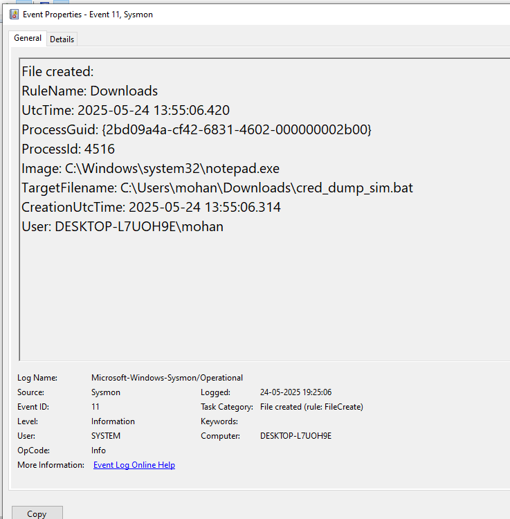
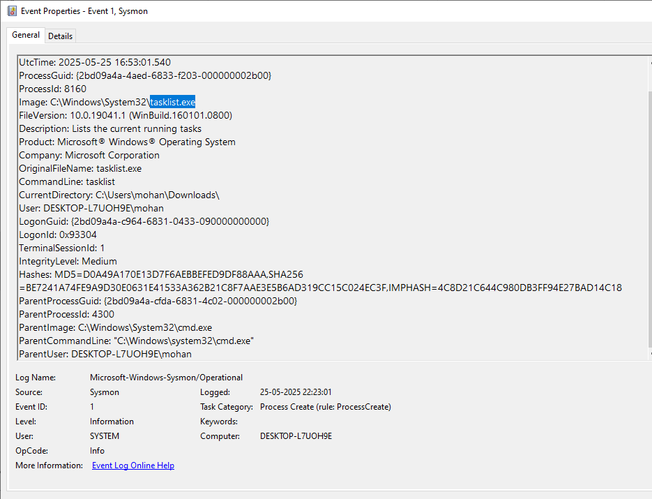
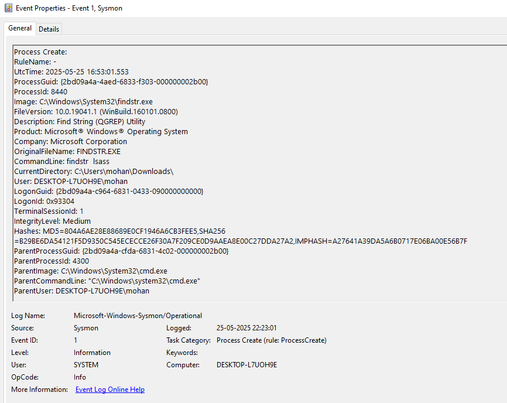
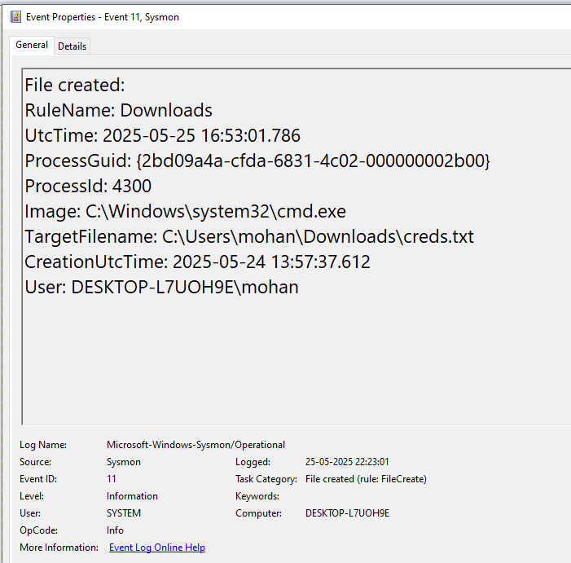
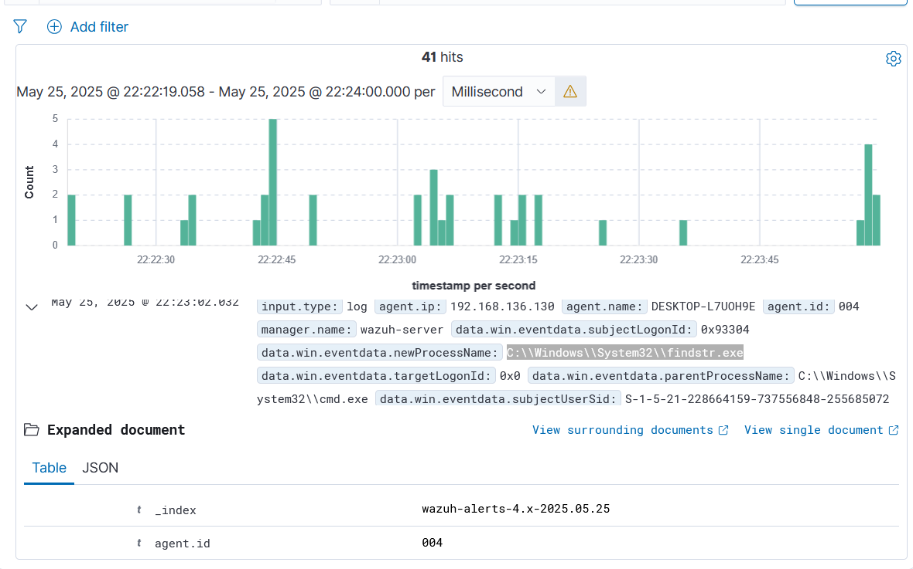

# Hint 8: Credential Dumping Simulation

## Simulation
I simulated a credential dumping attack on my Windows 10 VM to mimic an attacker attempting to extract credentials from memory after gaining access. I created a batch file (`cred_dump_sim.bat`) that simulates the behavior of a credential-dumping tool by enumerating processes to find `lsass.exe`, accessing the LSASS process, and saving a fake credential dump to a file.

## Command Used
```bat
@echo off
echo Simulating credential dumping...
REM Simulate enumerating processes to find LSASS
tasklist | findstr lsass
REM Simulate accessing LSASS process memory (mimicking a dump)
dir %SystemRoot%\System32\lsass.exe
REM Simulate saving the dumped credentials to a file
echo Simulated credential dump > C:\Users\mohan\Downloads\creds.txt
REM Simulate accessing the dumped file
type C:\Users\mohan\Downloads\creds.txt
echo Credential dumping simulation complete.
```

## Logs Generated
- **Sysmon Logs (Event Viewer):** Captured the process creation for `cred_dump_sim.bat` (Event ID 1), `tasklist.exe` (Event ID 1), `findstr.exe` (Event ID 1), and file creation for `creds.txt` (Event ID 11).  
- **Wazuh Dashboard:** Displayed the Sysmon events, confirming the activity was logged and forwarded.

## Screenshots
- **Sysmon Log for `cred_dump_sim.bat` Execution (Event ID 1):**   
- **Sysmon Log for `tasklist.exe` (Event ID 1):**   
- **Sysmon Log for `findstr.exe` (Event ID 1):**   
- **Wazuh Log for `findstr.exe` (Event ID 1):**   
- **Wazuh Log for File Creation (Event ID 11):** 

## Analysis
- **Pattern Observed:** The script execution began with `cred_dump_sim.bat` running (Event ID 1, see hint-8-1.png), which invoked `tasklist.exe` (Event ID 1, see hint-8-2.png) and `findstr.exe` to search for the `lsass.exe` process (Event ID 1, see hint-8-3.png and hint-8-4.png). A file `creds.txt` was created to simulate saving dumped credentials (Event ID 11, see hint-8-5.png).  
- **Fields Analyzed:**  
  - `data.win.eventdata.commandLine`: Contains `cred_dump_sim.bat` (hint-8-1.png)  
  - `data.win.eventdata.image`: `C:\Windows\System32\tasklist.exe` (hint-8-2.png)  
  - `data.win.eventdata.commandLine`: Contains `findstr lsass` (hint-8-3.png and hint-8-4.png)  
  - `data.win.eventdata.targetFilename`: `C:\Users\mohan\Downloads\creds.txt` (hint-8-5.png)  
- **Impact:** The enumeration of `lsass.exe` and creation of a file suggest an attempt to dump credentials, a common technique used by attackers to steal credentials for further attacks like lateral movement or privilege escalation.

## MITRE ATT&CK Mapping
- **T1059: Command and Scripting Interpreter** (Execution): The batch file (`cred_dump_sim.bat`) was executed via `cmd.exe` to run commands (hint-8-1.png).  
- **T1003: OS Credential Dumping** (Credential Access): The script simulated credential dumping by targeting `lsass.exe` (hint-8-3.png and hint-8-4.png) and saving a fake dump to a file (hint-8-5.png).  
- **T1057: Process Discovery** (Discovery): The `tasklist` and `findstr` commands were used to enumerate processes and identify `lsass.exe` (hint-8-2.png and hint-8-3.png).
```
