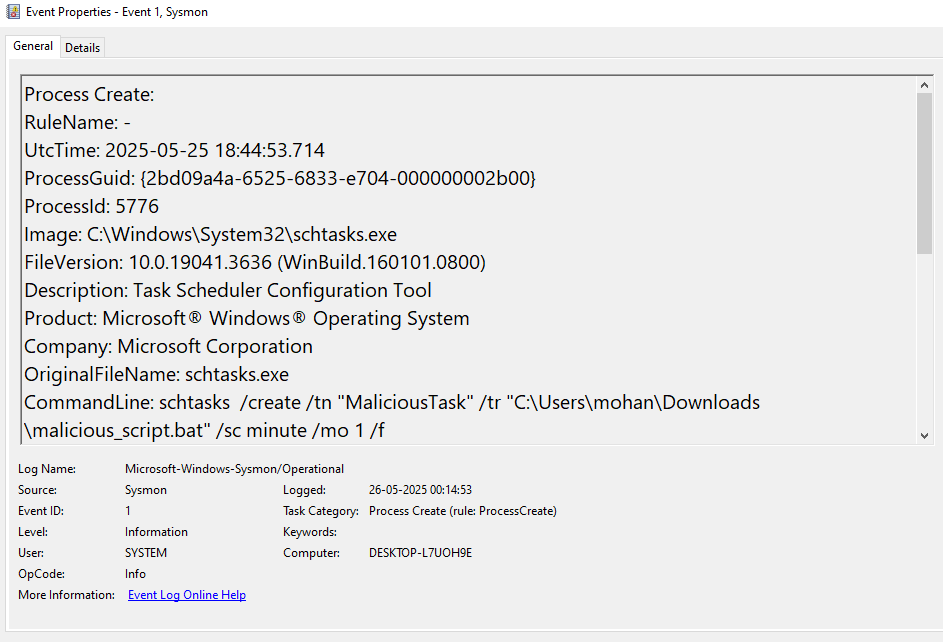
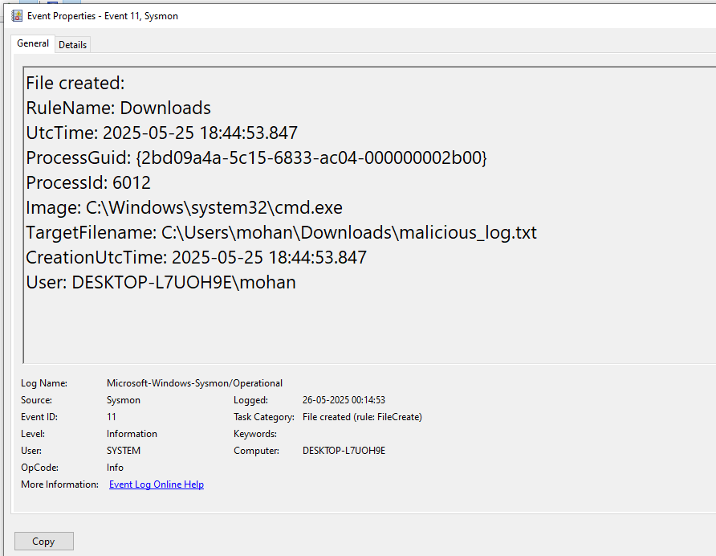
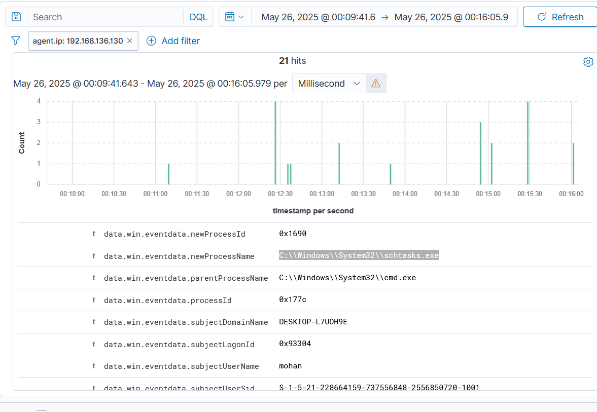

# Hint 10: Persistence Simulation

## Simulation
I simulated a persistence attack on my Windows 10 VM to mimic an attacker ensuring long-term access to the system. I created a batch file (`persist_sim.bat`) that sets up persistence by creating a scheduled task to run a fake malicious script (`malicious_script.bat`) every minute and adding a registry key to execute the script on startup.

## Command Used
```bat
@echo off
echo Simulating persistence mechanisms...
REM Create a scheduled task to run the fake malicious script every minute
schtasks /create /tn "MaliciousTask" /tr "C:\Users\mohan\Downloads\malicious_script.bat" /sc minute /mo 1 /f
REM Add a registry key to run the script on startup
reg add HKCU\Software\Microsoft\Windows\CurrentVersion\Run /v MaliciousScript /t REG_SZ /d "C:\Users\mohan\Downloads\malicious_script.bat" /f
REM Simulate the script running once
call C:\Users\mohan\Downloads\malicious_script.bat
echo Persistence simulation complete.
```

## Logs Generated
- **Sysmon Logs (Event Viewer):** Captured the process creation for `persist_sim.bat` (Event ID 1), `schtasks.exe` (Event ID 1), registry modification for the startup key (Event ID 13), and file creation for `malicious_log.txt` (Event ID 11).  
- **Wazuh Dashboard:** Displayed the Sysmon events, confirming the activity was logged and forwarded.

## Screenshots
- **Sysmon Log for `persist_sim.bat` Execution (Event ID 1):**   
- **Sysmon Log for `schtasks.exe` (Event ID 1):**   
- **Sysmon Log for Registry Modification (Event ID 13):**   
- **Sysmon Log for File Creation (Event ID 11):**   
- **Wazuh Log for Registry Modification (Event ID 13):** 

## Analysis
- **Pattern Observed:** The script execution began with `persist_sim.bat` running (Event ID 1, see hint-10-1.png), which invoked `schtasks.exe` to create a scheduled task (Event ID 1, see hint-10-2.png). A registry key was added to run the script on startup (Event ID 13, see hint-10-3.png and hint-10-5.png). The fake script executed and created `malicious_log.txt` (Event ID 11, see hint-10-4.png).  
- **Fields Analyzed:**  
  - `data.win.eventdata.commandLine`: Contains `persist_sim.bat` (hint-10-1.png)  
  - `data.win.eventdata.commandLine`: Contains `schtasks /create` (hint-10-2.png)  
  - `data.win.eventdata.targetObject`: Contains `MaliciousScript` (hint-10-3.png and hint-10-5.png)  
  - `data.win.eventdata.targetFilename`: `C:\Users\mohan\Downloads\malicious_log.txt` (hint-10-4.png)  
- **Impact:** The scheduled task and registry key ensure the fake script runs repeatedly and on startup, indicating a persistence mechanism to maintain access, a common technique used by attackers to ensure long-term control.

## MITRE ATT&CK Mapping
- **T1059: Command and Scripting Interpreter** (Execution): The batch file (`persist_sim.bat`) was executed via `cmd.exe` to run commands (hint-10-1.png).  
- **T1053: Scheduled Task/Job** (Persistence): The script created a scheduled task to run `malicious_script.bat` every minute (hint-10-2.png).  
- **T1547: Boot or Logon Autostart Execution** (Persistence): The script added a registry key in `HKCU\Software\Microsoft\Windows\CurrentVersion\Run` to execute the script on startup (hint-10-3.png and hint-10-5.png).

